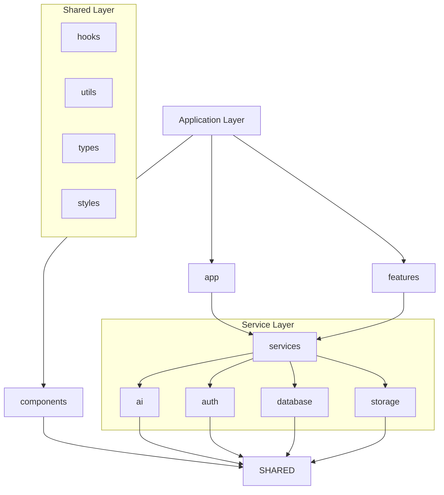

# Architecture

## Purpose

This document defines the official software architecture for this repository.

This repository is a reusable React + Capacitor mobile application framework. It is not an application. Every future mobile application built from this repository must follow the architecture described in this document.

The purpose of this document is to provide a single, authoritative architectural specification for both human developers and AI models. All code generated within this repository must conform to these architectural rules. Architectural consistency is more important than implementation convenience.

---

# High-Level Architecture

The framework follows a strict three-layer architecture.

```
Application Layer
        │
        ▼
Service Layer
        │
        ▼
Shared Layer
```

Each layer has a single responsibility.

| Layer             | Responsibility                                                         |
| ----------------- | ---------------------------------------------------------------------- |
| Application Layer | User interface, application composition, feature organization          |
| Service Layer     | Infrastructure, persistence, AI, authentication, external integrations |
| Shared Layer      | Reusable utilities, hooks, types and styling                           |

Business logic must remain isolated from presentation.

The framework follows:

* Offline-first
* Mobile-first
* Composition over inheritance
* Separation of concerns
* Provider abstraction

---

# Layer 1 — Application Layer

The Application Layer contains everything related to assembling the user interface.

It does not implement infrastructure.

It does not access databases directly.

---

## app/

### Purpose

Application bootstrap and global application configuration.

### Responsibilities

* Application startup
* Providers
* Routing
* Global configuration
* Error boundaries
* Application initialization

### What belongs here

* App.tsx
* main.tsx
* routes.tsx
* providers.tsx

### What must never be placed here

* Database logic
* Authentication implementation
* AI implementation
* Business logic
* SQL
* Utility functions

### Dependencies

May depend on:

* components/
* features/
* hooks/
* services/
* styles/
* types/
* utils/

### Design rationale

The application entry point should remain lightweight and responsible only for composing the application.

---

## features/

### Purpose

Organize the application into independent feature modules.

### Responsibilities

Each feature owns:

* UI
* feature-specific hooks
* feature-specific state
* feature-specific components

Features coordinate services but never implement infrastructure.

### What belongs here

Examples:

* timer
* notes
* tasks
* journal

Each feature contains only code related to that feature.

### What must never be placed here

* Generic UI components
* Shared utilities
* Database implementation
* Authentication implementation
* AI implementation

### Dependencies

May depend on:

* components/
* hooks/
* services/
* utils/
* types/

Must never depend directly on another feature.

### Design rationale

Features remain isolated and independently maintainable.

---

## components/

### Purpose

Reusable presentation components.

### Responsibilities

Provide reusable UI building blocks.

### What belongs here

* Buttons
* Cards
* Dialogs
* Forms
* Layout components
* shadcn/ui wrappers

### What must never be placed here

* Business logic
* Database code
* AI calls
* Authentication logic
* SQL
* API requests

### Dependencies

May depend on

* hooks
* styles
* types
* utils

### Design rationale

Components should be reusable across every application.

---

# Layer 2 — Service Layer

The Service Layer contains all infrastructure.

Nothing outside this layer should communicate directly with external systems.

---

## services/ai/

### Purpose

AI abstraction layer.

### Responsibilities

* Gemini integration
* Ollama integration
* Prompt execution
* AI provider abstraction

### What belongs here

* gemini.ts
* ollama.ts
* AI service interfaces

### What must never be placed here

* UI
* Components
* Business features

### Dependencies

May depend only on:

* utils
* types

### Design rationale

Applications should switch AI providers without changing application code.

---

## services/auth/

### Purpose

Authentication abstraction.

### Responsibilities

* Login
* Logout
* Session management
* Authentication providers

### What belongs here

* firebase.ts
* auth interfaces

### What must never be placed here

* UI
* Feature logic
* Business rules

### Dependencies

May depend only on

* utils
* types

### Design rationale

Authentication providers should be replaceable.

---

## services/database/

### Purpose

Database infrastructure.

### Responsibilities

* SQLite initialization
* Connection management
* Query execution
* Migrations
* Generic repositories

### What belongs here

* sqlite.ts
* migrations.ts
* BaseRepository.ts

### What must never be placed here

* Business repositories
* Application models
* Feature-specific SQL

### Dependencies

May depend only on

* utils
* types

### Design rationale

The database layer remains generic and reusable across every application.

---

## services/storage/

### Purpose

Persistent device storage.

### Responsibilities

* Preferences
* Settings
* Key-value storage

### What belongs here

* preferences.ts

### What must never be placed here

* SQL
* Business logic

### Dependencies

May depend only on

* utils
* types

### Design rationale

Storage remains independent from the database implementation.

---

# Layer 3 — Shared Layer

The Shared Layer provides reusable building blocks.

It contains no application-specific knowledge.

---

## hooks/

### Purpose

Reusable React hooks.

### Responsibilities

Encapsulate reusable React logic.

### What belongs here

* useTheme
* useDebounce
* useLocalStorage

### What must never be placed here

* SQL
* Business logic
* Feature-specific code

---

## utils/

### Purpose

Reusable helper functions.

### Responsibilities

Provide pure utility functions.

### What belongs here

* Date formatting
* Validation
* Formatting
* Constants

### What must never be placed here

* React components
* Database access
* Business logic

---

## types/

### Purpose

Shared TypeScript definitions.

### Responsibilities

Provide reusable interfaces and types.

### What belongs here

* Interfaces
* Enums
* Shared DTOs

### What must never be placed here

* Business implementations

---

## styles/

### Purpose

Global styling.

### Responsibilities

* Global CSS
* Themes
* Variables
* Design tokens

### What must never be placed here

* Components
* Business logic

---

# Dependency Rules

The architecture follows strict dependency rules.

| Layer             | May Depend On               |
| ----------------- | --------------------------- |
| Application Layer | Service Layer, Shared Layer |
| Service Layer     | Shared Layer                |
| Shared Layer      | Nothing above it            |

The following rules are mandatory.

* UI components must never access SQLite directly.
* UI components must never perform API requests.
* UI components must never contain business logic.
* Services must never import UI components.
* Services must never depend on features.
* Features must never directly depend on other features.
* Shared code must remain framework-agnostic.

---

# Data Flow

All requests follow the same direction.

```
UI

↓

Hook

↓

Service

↓

SQLite / AI / Authentication

↓

Service

↓

Hook

↓

UI
```

The UI communicates only through hooks and services.

---

# Design Principles

The framework follows these principles.

* Separation of concerns
* Offline-first
* Mobile-first
* Composition over inheritance
* Reuse over duplication
* Provider abstraction
* Scalability
* Testability
* Maintainability
* Strong typing
* Low coupling
* High cohesion

---

# Architectural Constraints

AI and developers must never:

* invent additional architecture layers
* invent new root folders
* bypass architectural layers
* move business logic into UI
* access SQLite directly from components
* introduce unapproved technologies
* duplicate services
* duplicate components
* duplicate utilities
* duplicate hooks
* create feature-specific infrastructure inside the framework

---

# Future Expansion

New capabilities must integrate into the existing architecture without changing its structure.

Future integrations should extend the Service Layer rather than modifying the Application Layer.

New features should be implemented inside `features/`.

New infrastructure should be implemented inside `services/`.

The Shared Layer should continue to grow as reusable functionality is extracted from applications.

The architecture should evolve through extension rather than restructuring.

---

# Mermaid Diagram


